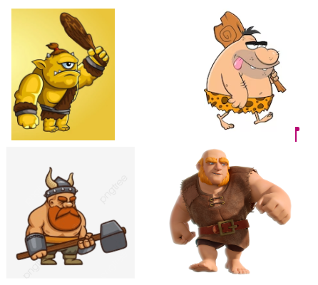
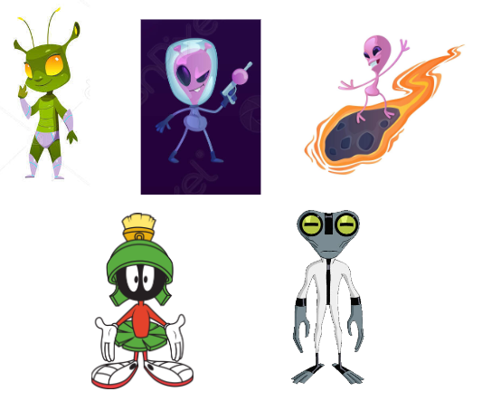
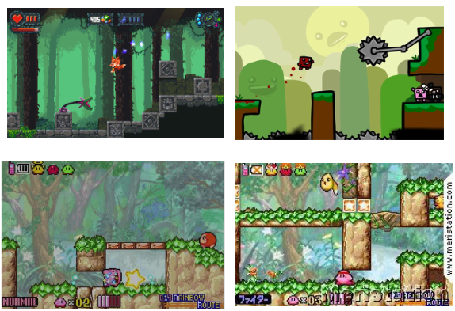
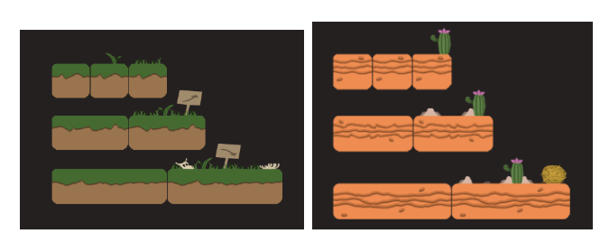

# Juego creado para la asignatura juegos en red para el curso 23/24
# /////////////////// INTEGRANTES DEL EQUIPO ///////////////////
 ## Daniel Pérez Navarro
Correo oficial: d.perezn.2021@alumnos.urjc.es
-- Cuenta GitHub: dperezn2021

 ## Mario Martin Escribano
Correo oficial: m.martine.2021@alumnos.urjc.es
-- Cuenta GitHub: mariome22

 ## Javier Martín García
Correo oficial: j.martinga.2021@alumnos.urjc.es
-- Cuenta GitHub: ReiXx03

 ## Marcos Vivar Muiño
Correo oficial: m.vivar.2021@alumnos.urjc.es
-- Cuenta GitHub: MarcosVivarMuiño

# /////////////////// CONCEPTOS DEL JUEGO ///////////////////
## NOMBRE DEL JUEGO Y DESCRIPCIÓN
El nombre elegido para nuestro juego ha sido Hitt and Ufo. Queríamos algo sencillo, relacionado con los personajes de nuestra historia: ‘Hitt’, de golpear, para un personaje fuerte y bruto, y ‘Ufo ’, para referirnos a un marciano de pequeño tamaño.

## HISTORIA
Nos encontramos en una época prematura del planeta Tierra, los humanos habitantes de la época son brutos, testarudos y poco inteligentes, viven en paz entre ellos, cazan y sobreviven como pueden utilizando su fuerza. De entre todos ellos, destaca Hitt, un líder innato, con una fuerza que sobrepasa lo inimaginable, que deberá guiar a su pueblo ante cualquier adversidad. Es entonces cuando Ufo, líder de los d’Aliens, junto con su grupo de guerreros extraterrestres, de tamaño reducido pero inteligencia superior, aterrizan en la tierra en busca de un nuevo planeta que adoctrinar. Lejos de poder enfrentarse a todo un planeta de bárbaros cromañones, los d’Aliens organizan una carrera líder contra líder, cuyo ganador definirá quién debe quedarse con el planeta Tierra. Hitt deberá sacar su poca inteligencia y sus enormes capacidades físicas para vencer a Ufo y defender la Tierra. Ufo en cambio, se aprovechará de su pequeño tamaño e intelecto superior para dejar a Hitt atrás. Inteligencia contra fuerza, ¿quién ganará?

## DESCRIPCIÓN DE LA TEMÁTICA DEL JUEGO
El juego se centra en una temática del estilo cartoon y ciencia ficción. “Hitt and Ufo” se desarrolla en el planeta Tierra, en una época prehistórica, un lugar exótico, lleno de vegetación, fauna y demás representaciones geográficas, al que se le suman los diversos objetos y materiales futuristas que los marcianos traen a la Tierra en su incursión.
El juego trata de 2 jugadores que, en una carrera de obstáculos por diferentes mapas, pretenden llegar al final antes que el otro. Para conseguirlo deberán sortear una serie de objetos, enemigos o puzzles dependiendo de las capacidades de cada personaje.
Hitt es un hombre forzudo pero poco inteligente, digno de la época prematura en la que se encuentra la Tierra de hace millones de años. Además, debido a su estatura y peso, es más lento que Ufo, que es un marciano pequeño y ligeramente más rápido y avanzado intelectualmente ya que procede de un planeta mucho más desarrollado.
Cada jugador deberá llegar a la meta lo antes posible, utilizando las herramientas y mecánicas según el personaje que maneje. En el caso de Hitt, se moverá algo más despacio pero podrá sortear obstáculos con mayor facilidad que Ufo, que tendrá que utilizar su ingenio y herramientas para avanzar.

## CONDICIONES DE VICTORIA Y DERROTA
A priori, la victoria y la derrota se pueden definir de forma muy sencilla, tal que el ganador será aquel jugador que alcance la meta primero. Sin embargo, no solo el que llegue primero a la meta será quien gane, hay alguna otra forma de eliminar a tu rival.
Esta forma será sacarlo de la pantalla, si un jugador es lo suficientemente rápido y consigue sacar la ventaja necesaria a su contrincante para hacer que salga de la pantalla por 5 segundos, el jugador que quede fuera de la pantalla será eliminado y la victoria será instantáneamente para el otro jugador.

# /////////////////// MECÁNICAS ///////////////////
## BÁSICAS
 ### Correr → Mas te vale ser el primero en llegar a la meta, o puede que tu civilización entera desaparezca.
 ### Saltar → Será necesario para aquellos casos donde esquivar obstáculos no sea la solución.
 ### Interacción con el entorno → ¿No pensarías que era tan fácil como correr y ya, verdad? Encontrarás distintos elementos en el mapa como cuerdas donde podrás balancearte o distintos objetos que podrás romper, por ejemplo.
 ### Conseguir objetos → Con esto podrás dificultar la experiencia a tu adversario, o quizás se te complique a ti.

## POWER-UPS
 ### LANZABLES
 #### Bola de hielo (Ralentiza, se le lanza al personaje contrario).
 #### Rayo paralizante (Aturde, se le lanza al personaje contrario).

 ### CONSUMIBLES
Poción rápida (Te da un 50% más de velocidad durante un corto periodo de tiempo) (Solo Hitt).

 ### “ARMADURA”
 #### Puño de oro (Te da un 50% más de fuerza durante un corto periodo de tiempo) (Solo Ufo).
 #### Botas Saltarinas (Proporciona doble salto a quien las consigue, durante un corto periodo de tiempo).

# /////////////////// DISEÑOS Y CONCEPT-ARTS ///////////////////
## PERSONAJES
Como ya hemos comentado, nuestros personajes serán Hitt, un cromañón testarudo, fuerte y bruto, que destroza todo lo que toca; y Ufo, un pequeño marciano de altas habilidades que con su inteligencia es capaz de cosas impensables.
 ### HITT
Para el bárbaro, pensamos en desarrollar un personaje estilo “cromañón” pero caricaturizado, de forma que quede algo cartoon y agradable, acorde con la temática de nuestro juego. Nos hemos basado en diferentes dibujos de típicos cavernícolas, vikingos forzudos y gigantes, como el del personaje del famoso juego “Clash of Clans”.

Por el momento, como primer boceto del futuro sprite, hemos diseñado un gigante forzudo que quedaría de la siguiente forma:

 ### UFO
Por el contrario, para Ufo, nos basamos en distintas ideas, tomando como referencias algunas caricaturas de marcianos típicos y personajes marcianos de series famosas como el marciano Marvin de “Looney Toons” o Materia Gris de “Ben 10”. 

Sin embargo, nos hemos decidido por realizar un alien metido en su nave, que utiliza para sacar sus herramientas y moverse más rápida y ágilmente.

## ESCENARIOS
Para los escenarios, hemos pensado en seguir la temática de animación y dibujos, basándonos en diferentes escenarios de juegos conocidos como “Furwind”, “Super Meat Boy” o “Kirby, & The Amazing Mirror”. 

Además, queremos darle una temática generalizada con el tema de la prehistoria, los dinosaurios o lo neandertal, puesto que la carrera se desarrollará en La Tierra, de hace millones de años, como ya hemos indicado en la historia.

A continuación se añaden imágenes de los tiles de dos escenarios: un escenario de tipo Campo y otro escenario de tipo Desierto.

En el tipo Campo podemos encontrar hierba, hierba más alta o huesos de animales para decorar el escenario. Además contendrá carteles para indicar la ruta que seguir para llegar al final.

En el caso del desierto podemos encontrar arena y piedras a modo de decoración de escenario. Y como objeto guía tenemos un cactus con una flor, con el brazo del cactus se guiará al jugador hacia la meta.

Aquí podemos observar un boceto muy básico de lo que sería el escenario de Campo, con su decoración, saltos y sus correspondientes carteles.

