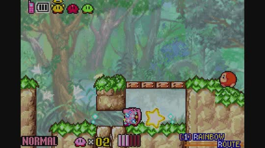
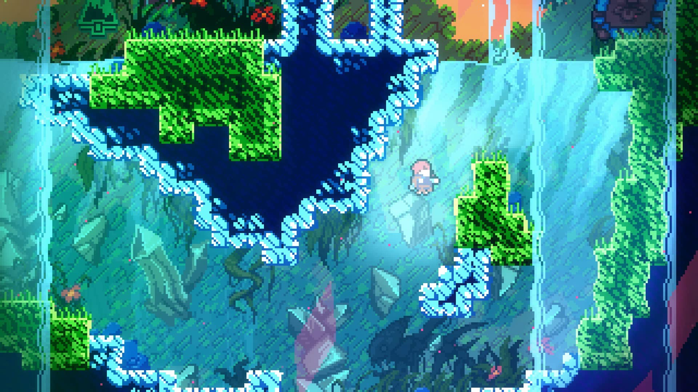
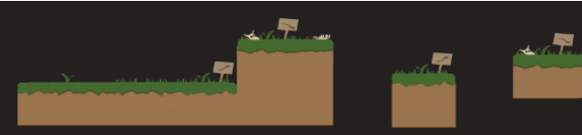
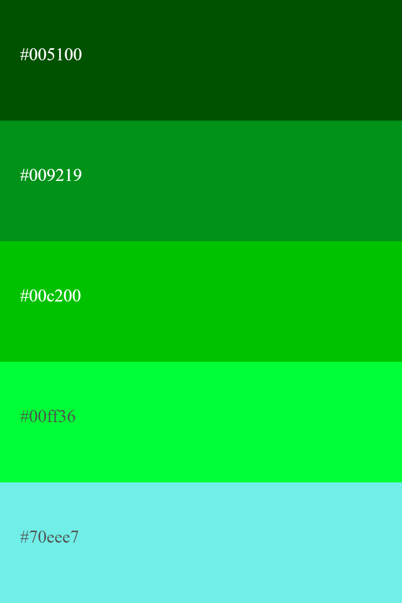
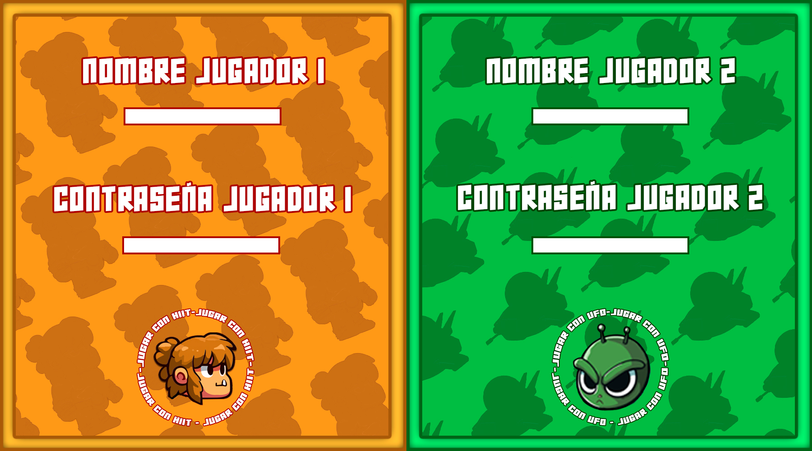

# GRUPO 10: GG TEAM
# “HITT AND UFO”
# INTEGRANTES
GG TEAM
Mario Martín Escribano	          Javier Martín García

Daniel Pérez Navarro 		  Marcos Vivar Muiño

# INTEGRANTES DEL EQUIPO
Daniel Pérez Navarro
Correo oficial: d.perezn.2021@alumnos.urjc.es
Cuenta GitHub: dperezn2021

Mario Martin Escribano
Correo oficial: m.martine.2021@alumnos.urjc.es
Cuenta GitHub: mariome22

Javier Martín García
Correo oficial: j.martinga.2021@alumnos.urjc.es
Cuenta GitHub: ReiXx03

Marcos Vivar Muiño
Correo oficial: m.vivar.2021@alumnos.urjc.es
Cuenta GitHub: MarcosVivarMuiño

# CONCEPTOS DEL JUEGO
## NOMBRE DEL JUEGO Y DESCRIPCIÓN
El nombre elegido para nuestro juego ha sido “Hitt and Ufo”. Se pretendía buscar algo sencillo, tal como los nombres de los personajes, que están relacionados con la naturaleza  de cada uno. 
‘Hitt’, es el nombre elegido para el cromañón, haciendo el juego de palabra con el término inglés ‘Hit’ que significa golpear. (Figura 1).

Figura 1: Spritesheet de Hitt

Mientras que para el marciano, se elige ‘UFO’, haciendo el símil con las siglas inglesas de “Unidentified Flying Object”, que es el OVNI en el que se mueve Ufo.(Figura 2).

Figura 2: Spritesheet de Ufo.

## HISTORIA
Nos encontramos en una época prematura del planeta Tierra, los humanos habitantes de la época son brutos, testarudos y poco inteligentes, viven en paz entre ellos, cazan y sobreviven como pueden utilizando su fuerza. De entre todos ellos, destaca Hitt, un líder innato, con una fuerza que sobrepasa lo inimaginable, que deberá guiar a su pueblo ante cualquier adversidad. Es entonces cuando Ufo, líder de los “d’Aliens”, junto con su grupo de guerreros extraterrestres, de tamaño reducido pero inteligencia superior, aterrizan en la tierra en busca de un nuevo planeta que adoctrinar.
Lejos de poder enfrentarse a todo un planeta de bárbaros cromañones, los “d’Aliens” organizan una carrera líder contra líder, cuyo ganador definirá quién debe quedarse con el planeta Tierra. Hitt deberá sacar su poca inteligencia y sus enormes capacidades físicas para vencer a Ufo y defender la Tierra. Ufo en cambio, se aprovechará de su pequeño tamaño e intelecto superior para dejar a Hitt atrás. Inteligencia contra fuerza, ¿quién ganará?
DESCRIPCIÓN DE LA TEMÁTICA DEL JUEGO
El juego se centra en una temática del estilo cartoon y ciencia ficción. “Hitt and Ufo” se desarrolla en el planeta Tierra, en una época prehistórica, en un planeta lleno de vegetación, fauna y demás representaciones geográficas, al que se le suman los diversos objetos y materiales futuristas que los marcianos traen a la Tierra en su incursión.
El juego trata de 2 jugadores que, en una carrera de obstáculos por diferentes mapas, pretenden llegar al final antes que el otro. Para conseguirlo deberán sortear una serie de obstáculos, trampas o puzzles, aprovechándose de las capacidades de cada personaje.
Hitt es un hombre forzudo pero poco inteligente, digno de la época prematura en la que se encuentra la Tierra de hace millones de años. Además, debido a su estatura y peso, es más lento que Ufo, que es un marciano pequeño y ligeramente más rápido y avanzado intelectualmente ya que procede de un planeta mucho más desarrollado.
Cada jugador deberá llegar a la meta lo antes posible, utilizando las herramientas y mecánicas según el personaje que maneje. En el caso de Hitt, se moverá algo más despacio pero podrá sortear obstáculos con mayor facilidad que Ufo, que tendrá que utilizar su ingenio y herramientas para avanzar.

## PÚBLICO OBJETIVO
	“Hitt and Ufo” es un juego de plataformas y parkour basado en algunos de los títulos más famosos del mercado como el “Celeste” (figura 3) o el mismo “Super Mario Bros” (figura 4). A diferencia de estos títulos, “Hitt and Ufo” es un juego casual, dedicado a todos los públicos, a aquellos jugadores a los que les gusten los juegos de competición y que quieran jugar partidas puntuales.

	
Figura 3: Celeste				Figura 4: Super Mario Bros

La historia del juego es básica para entender el contexto, al no ser un juego para realizar un modo historia, el tipo de jugadores que se buscan, son aquellos jugadores llamados “casuals” que buscan jugar partidas puntuales que no requieran ningún tipo de progreso previo ni ningún avance para guardar.

Por otra parte, se busca llegar a tanta gente como sea posible, de entre todos aquellos públicos que puedan tener acceso a ordenadores se ha seleccionado un público objetivo mayor a los 7 años, implementando un estilo cartoon que no resulta agresivo para aquellos jugadores menores que lo jueguen.

# ASPECTO TÉCNICO DEL JUEGO
## CONDICIONES DE VICTORIA Y DERROTA
A priori, la victoria y la derrota se pueden definir de forma muy sencilla, tal que el ganador será aquel jugador que alcance la meta primero. Sin embargo, esta no tiene por qué ser la forma en la que se gane, existen diversas formas.
La primera forma será por puntos, en el juego se irán otorgando puntos durante la carrera dependiendo de lo que logren hacer los corredores. Primero, por el mapa aparecerán monedas (Figura 5) que otorgarán 100 puntos por cada una de ellas recogida. En segundo lugar, habrá una llave (Figura 6) que dejará una puerta abierta, de tal forma que el primero que llegue a esa llave, conseguirá 1000 puntos y por último, el jugador que llegue primero a la meta, recibirá 2000 puntos.

Figura 5: Moneda

Figura 6: Llave

La segunda forma será sacarlo de la pantalla, si un jugador es lo suficientemente rápido y consigue sacar la ventaja necesaria a su contrincante para hacer que salga de la pantalla por un tiempo determinado, el jugador que quede fuera de la pantalla será eliminado y el otro jugador recibirá 1000 puntos.
Con estos métodos, conseguiremos que el juego tenga un nivel de estrategia superior que la de una simple carrera. Durante la partida los jugadores deberán pensar la mejor estrategia para poder ganar.
# MECÁNICAS
### 2.1. BÁSICAS
Estas son las mecánicas básicas que permiten avanzar en el juego, ya sean tanto de movilidad como de usabilidad:

Correr: Mas te vale ser el primero en llegar a la meta, o puede que tu civilización entera desaparezca.
Saltar: Será necesario para aquellos casos donde se deban esquivar obstáculos. 
Interacción con el entorno: Se puede interactuar con el entorno, empujando rocas, rompiendo puertas… (Figura 7).

Figura 7: Boceto interacción con el entorno

Conseguir objetos: Existen diversos “Power-Ups” para beneficio propio y objetos para dificultar el avance del rival.

### 2.2. POWER-UPS
En el juego podremos encontrar 3 tipos de “Power-Ups” diferentes, que saldrán de bloques misteriosos (Figura 8),  unos son los lanzables o arrojadizos, otros son consumibles y otros son armaduras.

Figura 8: Bloque misterioso

#### 2.2.1. LANZABLES
Bola de hielo: Objeto arrojadizo que se lanza al adversario para reducir su velocidad y obtener ventaja. (Figura 9)
Rayo paralizante: Rayo que aturde al rival, lo que le hace paralizarse y quedarse inmóvil por unos instantes. (Figura 10)

Figura 9: Bola de hielo

Figura 10: Rayo paralizante

#### 2.2.2. CONSUMIBLES
Poción rápida: Poción que otorga un 50% más de velocidad y que solo puede ser consumida por Hitt. (Figura 11)

Figura 11: Poción rápida
#### 2.2.3 .“ARMADURA”
Batería: Batería que recarga la nave de Ufo, lo que le otorga temporalmente un 50% más de fuerza. (Figura 12)

Figura 12: Batería

Botas Saltarinas: Proporciona doble salto a quien las consigue, durante un corto periodo de tiempo. (Figura 13)

Figura 13: Botas saltarinas

## CONTROLES EN LOCAL Y EN RED
El juego se puede jugar tanto en local, con ambos jugadores en un mismo dispositivo (Figura 14), como en red, donde cada jugador competirá desde su propio dispositivo (Figura 15).

En cuanto a los controles, existen 3 tipos de movimientos básicos y 2 de usabilidad. En la movilidad se puede avanzar hacia delante (derecha), hacia atrás (izquierda) y saltar (arriba). Mientras que en la usabilidad están la utilización de objetos y power ups y las interacciones.
	
En local, los controles para el jugador 1 se dividen de la siguiente forma:
“W”, “A”, “D” para movilidad siendo arriba, izquierda y derecha respectivamente. La tecla “S” no se utiliza ya que no existe un movimiento hacia abajo.
“Q”, “E” para usabilidad, siendo interacción y Power Ups respectivamente:

Mientras que para el jugador 2 se dividen de esta forma:
“I”, “J”, “L” para movilidad siendo arriba, izquierda y derecha respectivamente. La tecla “K” no se utiliza ya que no existe un movimiento hacia abajo.
“U”, “O” para usabilidad, siendo interacción y Power Ups respectivamente:

Figura 14. Controles en local de los jugadores

Por su parte, para le juego en red, los controles se reducen simplemente a los controles explicados para el jugador 1 en local. Es decir, “W”, ”A”, ”D”, ”Q”, ”E”, que serían para saltar, ir hacia la izquierda, ir hacia la derecha, usar un consumible e interactuar respectivamente.

Figura 15. Controles en red de los jugadores

# DISEÑOS Y CONCEPT-ARTS
## PERSONAJES
Como ya se ha comentado previamente, los personajes serán “Hitt”, un cromañón testarudo, fuerte y bruto, que destroza todo lo que toca; y “Ufo”, un pequeño marciano de altas habilidades que con su inteligencia es capaz de cosas impensables.

### 1.1. HITT
Para el bárbaro, pensamos en desarrollar un personaje estilo “cromañón” caricaturizado, plasmando un cartoon y agradable, acorde con la temática del juego. Para ello, el personaje ha sido basado en diferentes tipos de cavernícolas o gigantes, como los personajes del famoso juego “Clash of Clans”, el gigante (Figura 16) y el bárbaro (Figura 17), adaptando sus vestimentas a la ambientación prehistórica del juego.
			
Figura 16: Gigante, Clash of Clans

Figura 17: Bárbaro, Clash of Clans

Partiendo de la base de un boceto inicial, de un cavernícola más ambientado en un gigante, muy forzudo y con aspecto rudo (Figura 18), se decidió realizar un cambio a un nuevo Hitt, eligiendo un sprite con aspecto de mayor liderazgo, pero conservando los rasgos característicos de tozudez y menor inteligencia, así como el físico portentoso del cromañón (Figura 19). 
			     
Figura 18: Boceto inicial de Hitt

Figura 19: Sprite final de Hitt

Así podemos ver la paleta de colores del personaje (Figura 20), en el que predominan los tonos cálidos, colores como el naranja, el marrón o el de la piel que se combinan para dar uniformidad de color al personaje.

Figura 20: Paleta de colores de Hitt

### 1.2. UFO
En el caso del marciano, llamándose Ufo, se pensó que el mejor sprite posible sería el propio marciano subido en su OVNI particular, de tal forma que fuera su método de movimiento, lo que le permite ser más rápido que Hitt. Por lo que se elaboró un primer boceto inicial, de un marciano normal metido en su nave, la cual tiene los instrumentos necesarios para coger utilizables y poder disparar realizar la acción de pegar (Figura 21).

Figura 21: Boceto inicial de Ufo.

Primeramente, para el diseño del marciano, se tomaron como referencias algunos personajes de series famosas, como “Materia Gris (Ben 10)” (Figura 22), caricaturizándolo a un estilo más infantil, como el de “Marvin (Looney Tunes)” (Figura 23)
					
Figura 22: Materia Gris (Ben 10)

Figura 23: Marvin (Looney Toons)

Finalmente, al igual que con Hitt, se realizaron grandes avances y cambios en la idea del concepto, que permitieron elegir un sprite final para Ufo (Figura 24), que no se alejaba de la idea principal. Los cambios realizados fueron en la paleta de colores (Figura 25), poner colores más llamativos que pegasen con ese estilo cartoon de colores más vivos.
	
Figura 24: Sprite de Ufo.

Figura 25: Paleta de colores de Ufo

## NIVELES
Para los niveles, por ser un juego de plataformas, se basó el diseño en los mapas de algunos de los mejores juegos indie de plataformas de la actualidad. Intentando dar luz con elementos característicos de estos juegos, añadiendo mecánicas de “parkour” y elementos interactuables que dan lugar a puzzles, ya sean ruedas, llaves, plataformas móviles…

Por lo general, a la hora de realizar el diseño de niveles, se recabaron diversos títulos conocidos de este tipo de juegos, en base a estos títulos se fueron cogiendo ideas de cada uno de ellos, ya que  como ejemplo, las físicas que mejor encajaban con el juego a al hora de implementar la movilidad, serían las de juegos como “Furwind” (Figura 26) o “Kirby, & The Amazing Mirror” (Figura 27)

		
Figura 26: Furwind

Figura 27: Kirby & the Amazing Mirror

Sin embargo, en base a la difícil implementación de físicas y movilidad de juegos como el “Celeste” (Figura 25), se ha tomado de referencia junto a otro de los grandes juegos como el “Hollow Knight” (Figura 26), para tomar ideas sobre puzzles y “Power-Ups” útiles para nuestro juego

	           
Figura 28: Celeste

Figura 29: Hollow Knight

De esta forma, teniendo en cuenta las posibilidades de implementación, se ha realizado un boceto para el diseño de niveles, que incluye elementos tales como plataformas para “parkour”, pinchos, agua y lava como elementos que hacen daño, puzzles que implican romper objetos o moverlos, así como una recogida de objetos tales como monedas, “Power-Ups” y una llave, necesaria la última para pasarse el nivel. Así acaba finalmente el boceto de diseño de niveles, la primera mitad (Figura 30) y la segunda mitad (Figura 31).

Figura 30: Boceto de la primera mitad del nivel

Figura 31: Boceto de la segunda mitad del nivel

## ESCENARIOS
Con todo el diseño de niveles ya definido y el diseño general de los personajes, se establece el diseño de los tiles y demás objetos que formarán parte del escenario. Para ello, una vez más, se tomó referencia de algunos de los juegos de plataformas más populares, alguno ya mencionado como el “Kirby, & The Amazing Mirror” (Figura 32), cuyos colores y ambientación general eran los más adecuados para nuestro juego. Para su adaptación, se fusionó junto con el diseño del dibujo de “The Meat Boy” (Figura 33).
		
Figura 32: Kirby, & The Amazing Mirror

Figura 33: The Meat Boy

En el juego se implementarán varios niveles, es por eso que podemos encontrar diversas ambientaciones dependiendo del lugar en el que transcurra la carrera (Figura 34).
De esta forma, el primer escenario que encontraremos será la pradera, en la que encontraremos bloques de tierra y césped, con adornos como calaveras de animales o carteles que indican las direcciones por las que poder avanzar.

Figura 34: Tiles de pradera

La paleta de ambos escenarios contendrá colores similares pero en tonalidades diferentes, para poder jugar así con la ambientación del lugar, viendo marrones para pradera y naranjas para el desierto, verde para la hierba de la pradera y los cactus del desierto y blancos y grises para las calaveras de la pradera y las piedras del desierto, así como el azul del agua (Figura 35).

Figura 35: Paleta de colores de los tiles

Una vez disponemos de los tiles necesarios para la creación de los escenarios, quedan implementados como suelos, plataformas y techos, en el primer nivel de la siguiente manera (Figuras 36):

Figura 36: Escenario 1, primera parte

## LOGO DEL JUEGO
Para el logo del juego (Figura 38) se ha decidido seguir el estilo cartoon, dividiendo el logo en 2 partes, por una parte el nombre de Hitt, envuelto en la estela de llamas naranjas, rojas y amarillas de un asteroide granate por el fuego (Figura 39), representando la época prehistórica a la que pertenecen Hitt y su pueblo. Por otro lado, el nombre de UFO, envuelto en una estela moderna, de tonalidades verdes (Figura 40), de estilo digital y futurista que representa la llegada del ovni con la población alienígena. De esta forma, podemos combinar el logo jugando con las ambientaciones antiguas y modernas para cada personaje.

Figura 38: Logo del juego

			
Figura 39: Paleta de color logo Hitt

Figura 40: Paleta de color logo Ufo

## MENÚ DE INICIO
Para el menú de inicio (Figura 41), se ha dibujado tanto un fondo de pantalla personalizado, como un fondo con un marco personalizado para el logo del juego.

Para el fondo de pantalla, se ha hecho una composición con la supuesta nave alienígena en el centro, con un haz de luz que contendría las opciones de la pantalla, “Jugar”, “Ajustes” y “Salir”.

A cada lado del haz de luz, se han añadido a ambos protagonistas del juego, a la izquierda Hitt y a la derecha Ufo.

Figura 41: Diseño del menú de inicio

En cuanto a la paleta de colores (Figura 42), para implementar correctamente tanto el logo del juego como las opciones a elegir en pantalla, se ha incluido un sombreado negro, que deja el fondo de pantalla en segundo plano y permite resaltar las opciones y el logo. Lo que deja en el fondo, un diseño de colores oscuros, mezclando el azul del cielo anochecido, con los grises de la nave. Haciendo resaltar los detalles brillantes de las luces verdes y amarillas de la nave, junto con el haz de luz amarillo que sale de la propia nave.

Figura 42: Paleta de colores del menú de inicio

De esta forma, al logo del juego (Figura 43), se le ha incluido un marco con un fondo más visual, a modo de cartel, en el que se sigue jugando con esa combinación de ambientaciones de ambos personajes, incluyendo un marco de piedra para la mitad del logo de Hitt y un marco de neón para la mitad del logo de UFO. Todo ello con un fondo estrellado simulando el espacio exterior.

Figura 43: Marco para el logo del juego

Por lo que para la paleta de colores de este marco (Figura 42), se han combinado los colores grises del marco de piedra de la mitad alta, con el contraste verde del borde neón de la mitad baja. Todo ello por encima de un fondo negro con estrellas blancas que ayuda a resaltar el logo.

Figura 44: Paleta de colores del marco del logo

## INTERFAZ DE VICTORIA Y DERROTA
Finalmente, a la hora de determinar el ganador, se ha desarrollado una interfaz final dedicada a esta condición (Figuras 45 y 46). Dividiendo en dos la pantalla, la zona en la que aparece el ganador será mayor que la del perdedor. En cada mitad se definirá el nombre, el sprite y la puntuación de cada uno.

Figura 45: Interfaz de victoria de Ufo

Figura 46: Interfaz de victoria de Hitt

## INTERFACES DE REGISTRO
Para el registro de los jugadores se han diseñado 3 interfaces distintas que abarcan el proceso. Todas estas interfaces siguiendo el miismo patrón de diseño para estar acorde a la estética general. En ellas podremos ver la pantalla dividida en 2 partes, una mitad tematizada con Hiit y la otra con UFO.

La primera interfaz (figura 47) es en la que los usuarios podrán elegir si quieren iniciar sesión en una cuenta ya existente o crear una.

Figura 47: Registro o inicio de sesión

La segund ainterfaz (figura 48) será la que se use para realizar el registro o el inicio de sesión del jugador que lo haya elegido, además se ha añadido la funcionalidad de poder poner una nueva contraseña.

Figura 48: Registro de usuarios

La tercera interfaz (figura 49) servirá para restablecer la contraseña del usuario.

Figura 49: Nueva contraseña

De esta forma la paleta de colores utilizada para estas interfaces queda de la siguiente forma (figura 50):

## BOTONES INTERFACES
Se han creado diversos botones para implementar en las interfaces, todos ellos siguiendo una estética común, estilo cartoon, con sombras y luces que resaltan el efecto 3D.(Figuras 51, 52, 53 y 54).

(Figuras 51)

(Figuras 52)

(Figuras 53)

(Figuras 54)

## MÚSICA Y SONIDOS
Se han creado 2 canciones con la herramienta “Soundtrap”, una que ha sido implementada en el menú principal, justo en la pantalla de inicio (Figura 51), y otra totalmente diferente como música de fondo del videojuego (Figura 56).

Figura 55: Patrón de la música de la pantalla de inicio

Figura 56: Patrón de la música de fondo del videojuego

Además, se han incluido diferentes sonidos, extraídos de la página web de “Pixabay”, como los siguientes:
- Coger moneda
- Coger Power-Up
- Tirar Power-Up
- Victoria
- Caerse al agua o a la lava
- Saltar
- ...

# FLUJOGRAMA
Por último se ha incluido un flujograma que muestra el avance entre las diferentes pantallas del juego mediante el siguiente esquema (Figura 53).

Figura 57: Flujograma

# INSTRUCCIONES PRECISAS PARA EJECUTAR LA APLICACIÓN+
## 1. Eclipse SpringBoot
Abrimos la aplicacion Eclipse Spring Boot.
## 2. Carpeta del proyecto
Abrimos la carpeta F3_API de nuestro explorador de archivos.
## 3. F3ApiApplication.java
Seleccionamos dentro de la carpeta src/main/java nuestro archivo F3ApiApplication.java.
## 4. Inicializar servidor
Iniciamos el servidor como Java Application.
## 5. Abrir navegador
Iniciamos el navegador, donde se levantará el servidor y se ejecutará el archivo .html. 
## 6. Disfrutar del juego
Con esto, ya tenemos la posibilidad de jugar a este juego. ¡A disfrutar!
